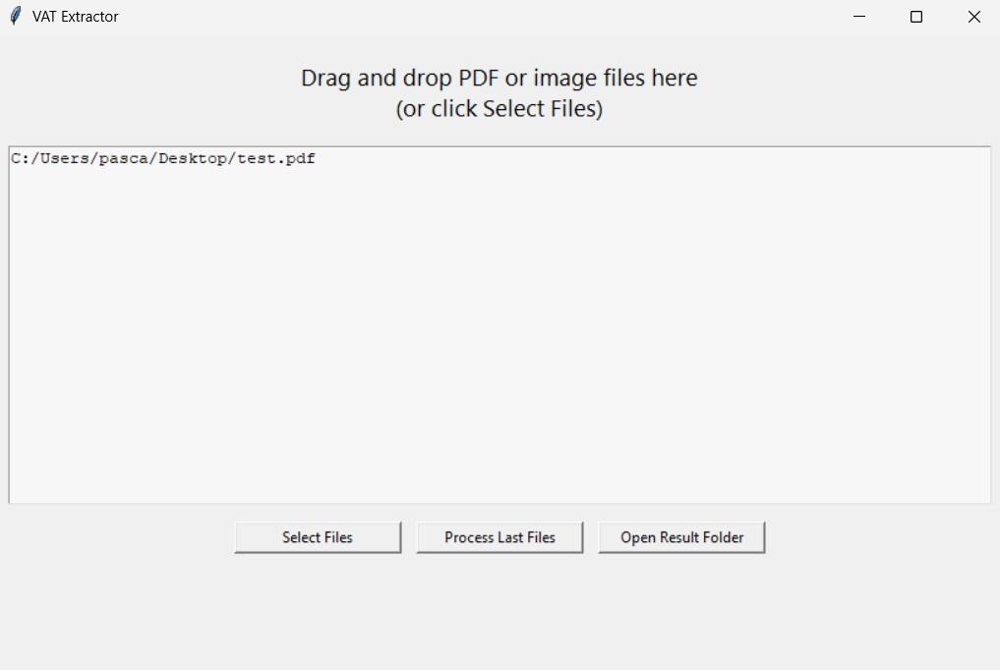
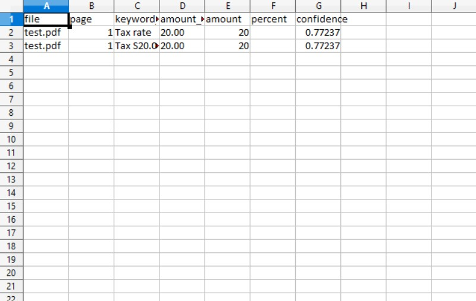

# VAT Extractor

A Python desktop application for extracting VAT and tax information from PDF documents and images using OCR.

The application detects VAT-related keywords in German and English, identifies nearby tax amounts and percentages, and exports the extracted data to an Excel spreadsheet.

## Features

- Extracts VAT information from:
  - PDF files
  - PNG images
  - JPG/JPEG images
  - TIFF images
  - BMP images
- Supports German and English VAT terminology
- Uses EasyOCR for text recognition
- Uses PyMuPDF to render PDF pages
- Detects:
  - VAT amounts
  - VAT percentages
  - Tax-related text
- Ignores common tax identification numbers, such as:
  - Tax ID
  - Tax number
  - Steuernummer
  - USt-IdNr.
- Supports multiple files at once
- Provides a graphical interface using Tkinter
- Supports drag-and-drop when `tkinterdnd2` is available
- Exports results to `vat_results.xlsx`
- Automatically opens the generated Excel file when processing is complete
- Includes a local Flask status and download endpoint

## Demo

### First Screenshot



### Second Screenshot




## Supported VAT Terms

The extractor recognizes common VAT terms, including:

- `VAT`
- `VAT Amount`
- `VAT Total`
- `Tax Amount`
- `Sales Tax`
- `Value Added Tax`
- `Umsatzsteuer`
- `Mehrwertsteuer`
- `Mehrwertsteuerbetrag`
- `MwSt.`
- `USt.`
- `inkl. MwSt.`
- `exkl. MwSt.`
- `zzgl.`
- `inklusive`
- `exklusive`

## Requirements

- Python 3.8 or newer
- Tkinter
- A working graphical desktop environment
- Internet access during the first run, if dependencies are not already installed

The application uses the following Python packages:

- Flask
- pandas
- openpyxl
- Pillow
- tkinterdnd2
- EasyOCR
- PyTorch
- PyMuPDF
- NumPy

## Installation

Clone the repository:

```bash
git clone https://github.com/YOUR_USERNAME/YOUR_REPOSITORY.git
cd YOUR_REPOSITORY
```

Run the application:

```bash
python vat.py
```

The script attempts to install missing Python packages automatically.

For a more predictable setup, install the dependencies manually:

```bash
pip install flask pandas openpyxl Pillow tkinterdnd2 easyocr torch PyMuPDF numpy
```

On some Linux systems, Tkinter must be installed separately:

```bash
sudo apt-get install python3-tk
```

## Usage

Start the application:

```bash
python vat.py
```

Then either:

1. Drag and drop PDF or image files into the application window, or
2. Click **Select Files** and choose one or more files.

Files are processed automatically after selection.

You can also click **Process Last Files** to process the most recently selected files again.

## Output

The extracted results are saved in the current working directory as:

```text
vat_results.xlsx
```

The Excel file contains the following columns:

| Column | Description |
|---|---|
| `file` | Name of the processed file |
| `page` | Page number where the VAT information was found |
| `keyword_line` | Line containing the detected VAT keyword |
| `amount_raw` | Amount as detected by OCR |
| `amount` | Normalized numeric amount |
| `percent` | Detected VAT percentage |
| `confidence` | Average OCR confidence for the selected line |

Example output:

| file | page | keyword_line | amount_raw | amount | percent |
|---|---:|---|---:|---:|---:|
| invoice.pdf | 1 | VAT 19% | 19.00 | 19.00 | 19.0 |

If no VAT information is found, the file is still included in the spreadsheet with empty result fields.

## Local API

The application starts a local Flask server on port `5001`.

### Check Processing Status

```http
GET http://localhost:5001/status
```

Example response:

```json
{
  "status": "done",
  "files": [
    "invoice.pdf"
  ],
  "result": "/path/to/vat_results.xlsx"
}
```

### Download the Result File

```http
GET http://localhost:5001/download
```

The endpoint returns the generated `vat_results.xlsx` file when it exists.

## Project Structure

```text
.
├── vat.py
├── vat_results.xlsx
└── README.md
```

## How It Works

1. The application receives PDF or image files.
2. PDF pages are rendered into images using PyMuPDF.
3. EasyOCR extracts text tokens and their positions.
4. OCR tokens are grouped into visual lines.
5. VAT-related keywords are detected.
6. Nearby currency amounts and percentages are searched.
7. Tax identification numbers are excluded using negative keyword matching.
8. Results are written to an Excel spreadsheet using pandas and openpyxl.

## Limitations

- OCR accuracy depends on image quality, document layout, and scan resolution.
- Handwritten or heavily distorted documents may not be recognized correctly.
- VAT values are selected based on proximity to detected VAT keywords.
- Complex tables may produce inaccurate associations between labels and amounts.
- EasyOCR and PyTorch may require significant disk space and memory.
- Drag-and-drop functionality depends on `tkinterdnd2` and the operating system.
- The Flask server is intended for local use.

## Troubleshooting

### EasyOCR Fails to Initialize

Install EasyOCR and PyTorch manually:

```bash
pip install easyocr torch
```

Then run the application again:

```bash
python vat.py
```

### Tkinter Cannot Be Started

Install Tkinter for your operating system. On Debian or Ubuntu:

```bash
sudo apt-get install python3-tk
```

### Drag-and-Drop Does Not Work

Install the optional drag-and-drop package:

```bash
pip install tkinterdnd2
```

You can still use the **Select Files** button if drag-and-drop is unavailable.

### The Excel File Is Not Opened Automatically

The file is still saved as:

```text
vat_results.xlsx
```

Open it manually from the directory where `vat.py` was started.

## License

Add your preferred license here, for example:

```text
MIT License
```
